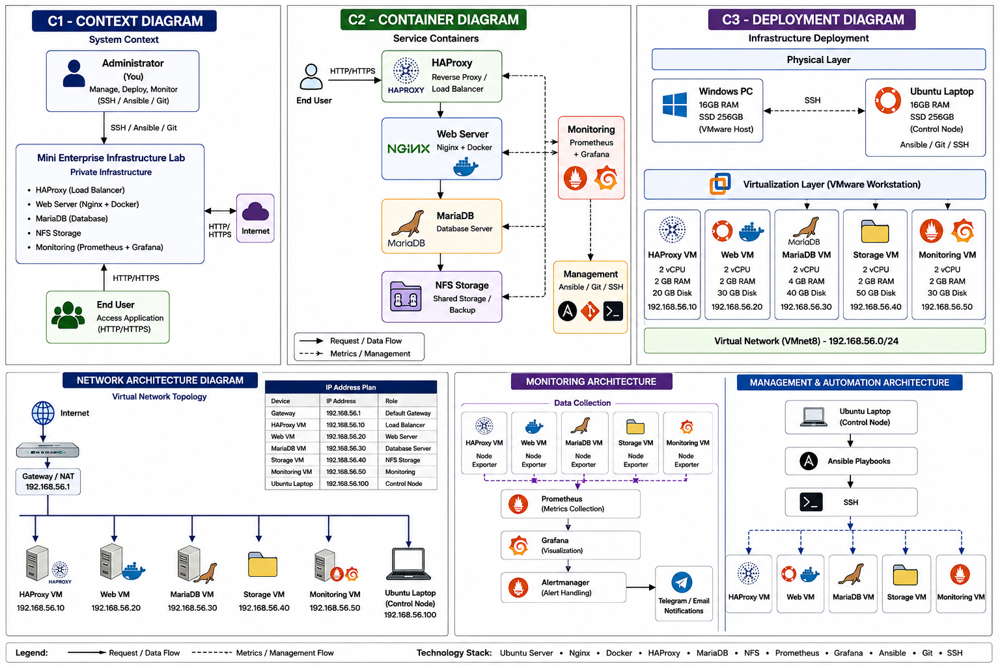

# Enterprise Infrastructure Lab

Lab hạ tầng doanh nghiệp được xây dựng bằng VMware và Ansible, mô phỏng một
hệ thống vận hành theo mô hình production nhỏ: Load Balancer, Web Server,
Database, Storage, Monitoring, Firewall, HTTPS, cảnh báo và quy trình xử lý
sự cố.

## Trạng thái hiện tại

Lab đã hoàn thiện luồng dịch vụ chính và đã được kiểm chứng:

- HAProxy phân phối request đến hai Web Server.
- HAProxy kiểm tra HTTP `GET /healthz` trước khi đưa backend vào phục vụ.
- HTTP tự chuyển hướng sang HTTPS.
- Hai Web Server dùng chung dữ liệu từ NFSv4.
- Hai Web Server có tài khoản ứng dụng riêng để truy cập MariaDB.
- Firewall UFW giới hạn lưu lượng giữa từng lớp.
- Prometheus, Grafana, Alertmanager và Node Exporter hoạt động.
- Alertmanager gửi cảnh báo Telegram thông qua Ansible Vault.
- Dashboard Grafana được tự động provision.
- Playbook chạy lại đạt `changed=0` trên toàn bộ hạ tầng.
- Có runbook cho service, disk, network và NFS.
- Có role backup cho NFS/MariaDB và restore validation an toàn.

## Kiến trúc

<p align="center">
  
</p>

```text
                         Client / Admin
                               |
                         HTTP / HTTPS
                               |
                +------------------------------+
                | HAProxy 10.10.0.210           |
                | TLS termination + healthcheck |
                +---------------+--------------+
                                |
                  +-------------+-------------+
                  |                           |
        +---------v---------+       +---------v---------+
        | Web Server        |       | Web Server 2       |
        | 10.10.0.220       |       | 10.10.0.221        |
        | Nginx + NFS       |       | Nginx + NFS        |
        +---------+---------+       +---------+----------+
                  |                           |
                  +-------------+-------------+
                                |
              +-----------------+-----------------+
              |                                   |
      +-------v--------+                  +-------v--------+
      | MariaDB        |                  | NFS Storage     |
      | 10.10.0.230    |                  | 10.10.0.240    |
      | enterprise_app |                  | /srv/nfs/shared |
      +----------------+                  +----------------+

      Monitor 10.10.0.250 -> Prometheus -> Grafana / Alertmanager / Telegram
                              |
                         Node Exporter :9100
```

## Máy chủ

| Nhóm | Hostname | IP | Vai trò |
|---|---|---:|---|
| `haproxy` | `loadbalancer` | `10.10.0.210` | HAProxy, HTTPS termination |
| `web` | `webserver` | `10.10.0.220` | Nginx, NFS client, MariaDB client |
| `web` | `webserver2` | `10.10.0.221` | Nginx, NFS client, MariaDB client |
| `database` | `mariadb` | `10.10.0.230` | MariaDB Server |
| `storage` | `storagenfs` | `10.10.0.240` | NFS Server |
| `monitoring` | `monitor` | `10.10.0.250` | Prometheus, Grafana, Alertmanager |

## Luồng hoạt động

### Request Web

```text
Client
  -> HAProxy:80  -> redirect HTTPS
  -> HAProxy:443
  -> HTTP health check /healthz
  -> webserver hoặc webserver2:80
  -> Nginx
  -> dữ liệu từ NFS /var/www/html
```

HAProxy chỉ chuyển request đến backend trả `200` cho endpoint `/healthz`. Khi
một Web Server dừng, backend còn lại tiếp tục phục vụ request.

### Web và dữ liệu

```text
Web Server -> NFSv4 10.10.0.240:2049
Web Server -> MariaDB 10.10.0.230:3306
```

Database ứng dụng là `enterprise_app`, tài khoản `webapp` chỉ được phép truy
cập từ IP của các Web Server và có quyền `SELECT`, `INSERT`, `UPDATE`,
`DELETE`.

### Monitoring

```text
Node Exporter :9100 trên toàn bộ host
        -> Prometheus :9090
        -> Grafana :3000
        -> Alertmanager :9093
        -> Telegram
```

Các cảnh báo hiện có:

- Node Exporter không phản hồi.
- CPU sử dụng cao.
- RAM sử dụng cao.
- Filesystem gần đầy từ 85%.
- Filesystem nghiêm trọng từ 95%.

Prometheus được giới hạn retention `15d` và `5GB`; Docker log được giới hạn
để tránh làm đầy filesystem máy monitor.

## Firewall

| Nguồn | Đích | Port | Mục đích |
|---|---|---:|---|
| Mạng quản trị | Tất cả máy | `22/tcp` | SSH quản trị |
| Người dùng | HAProxy | `80,443/tcp` | Truy cập Web |
| HAProxy | Web Server | `80/tcp` | Proxy request và health check |
| Web Server | MariaDB | `3306/tcp` | Kết nối database |
| Web Server | NFS | `2049/tcp` | Mount NFSv4 |
| Monitor | Tất cả máy | `9100/tcp` | Scrape Node Exporter |
| Mạng quản trị | Monitor | `3000,9090,9093/tcp` | Grafana, Prometheus, Alertmanager |

Firewall được bật bằng UFW với chính sách mặc định `deny incoming` và
`allow outgoing`.

## Monitoring URLs

| Dịch vụ | URL |
|---|---|
| Grafana | `http://10.10.0.250:3000` |
| Prometheus | `http://10.10.0.250:9090` |
| Alertmanager | `http://10.10.0.250:9093` |

Dashboard Grafana được provision tự động từ:

```text
ansible/roles/monitoring/files/grafana/dashboards/infrastructure-overview.json
```

## Cấu trúc repository

```text
.
├── architecture/
│   └── architecture.png
├── ansible/
│   ├── inventory.ini
│   ├── playbooks/
│   └── roles/
│       ├── common/
│       ├── docker/
│       ├── firewall/
│       ├── haproxy/
│       ├── mariadb/
│       ├── monitoring/
│       ├── node_exporter/
│       ├── storagenfs/
│       └── webserver/
└── docs/
    └── runbooks/
```

## Triển khai

### Điều kiện

- Các VM đã tạo trên VMware và cùng mạng quản trị.
- IP, hostname và MAC address không bị trùng.
- Máy điều khiển SSH được đến toàn bộ VM bằng user `hoangnh`.
- Ansible và các collection cần thiết đã được cài đặt.
- File Vault chứa Telegram token và mật khẩu MariaDB đã được mã hóa.

Kiểm tra kết nối:

```bash
cd ansible
ansible all -i inventory.ini -m ping
```

Chạy toàn bộ hạ tầng:

```bash
ansible-playbook -i inventory.ini playbooks/site.yml --ask-vault-pass
```

Chạy riêng từng lớp:

```bash
ansible-playbook -i inventory.ini playbooks/haproxy.yml --ask-vault-pass
ansible-playbook -i inventory.ini playbooks/webserver.yml --ask-vault-pass
ansible-playbook -i inventory.ini playbooks/mariadb.yml --ask-vault-pass
ansible-playbook -i inventory.ini playbooks/storagenfs.yml --ask-vault-pass
ansible-playbook -i inventory.ini playbooks/firewall.yml --ask-vault-pass
ansible-playbook -i inventory.ini playbooks/monitoring.yml --ask-vault-pass
```

## Secrets

Các file secret không được commit:

```text
ansible/group_vars/monitoring/vault.yml
ansible/group_vars/database/vault.yml
```

Mở hoặc chỉnh sửa bằng Ansible Vault:

```bash
ansible-vault edit ansible/group_vars/monitoring/vault.yml
ansible-vault edit ansible/group_vars/database/vault.yml
```

Không ghi Telegram token, mật khẩu MariaDB hoặc private key TLS vào README,
inventory hay template không mã hóa.

## Kiểm thử vận hành

Kiểm tra HTTPS và health check:

```bash
curl -k -I https://10.10.0.210/healthz
curl -k https://10.10.0.210/
```

Kiểm tra failover Web Server:

```bash
ansible webserver -i inventory.ini -b -m service \
  -a 'name=nginx state=stopped'
sleep 5
curl -k -I https://10.10.0.210/healthz
ansible webserver -i inventory.ini -b -m service \
  -a 'name=nginx state=started'
```

Thực hiện tương tự với `webserver2`, nhưng không dừng cả hai máy cùng lúc.

Kiểm tra idempotency:

```bash
ansible-playbook -i inventory.ini playbooks/site.yml --ask-vault-pass
```

Kết quả mong muốn sau lần chạy ổn định:

```text
changed=0
failed=0
unreachable=0
```

## Runbook

- [Service bị dừng](docs/runbooks/service-down.md)
- [Filesystem đầy](docs/runbooks/disk-full.md)
- [Mất kết nối giữa các lớp](docs/runbooks/network-unreachable.md)
- [Lỗi NFS](docs/runbooks/nfs-failure.md)
- [Backup và Restore](docs/runbooks/backup-restore.md)

## Hạn chế hiện tại và hướng phát triển

Các thành phần sau chưa được triển khai:

- HAProxy hiện vẫn là một điểm lỗi duy nhất; chưa có Keepalived/VRRP.
- MariaDB chưa có replication hoặc Galera.
- NFS chưa có storage redundancy.
- Backup NFS đã triển khai; backup/restore MariaDB cần chạy validation lần đầu.
- Chưa thực hiện bài kiểm thử RTO/RPO chính thức.
- Chưa tự động tạo VM VMware bằng Terraform hoặc Ansible.

Thứ tự phát triển tiếp theo:

1. Hoàn tất chạy backup và restore validation MariaDB.
2. Thêm Keepalived cho HAProxy.
3. Triển khai MariaDB replication hoặc Galera.
4. Tự động hóa provisioning VMware.
5. Bổ sung CI kiểm tra Ansible syntax, lint và secret scanning.
